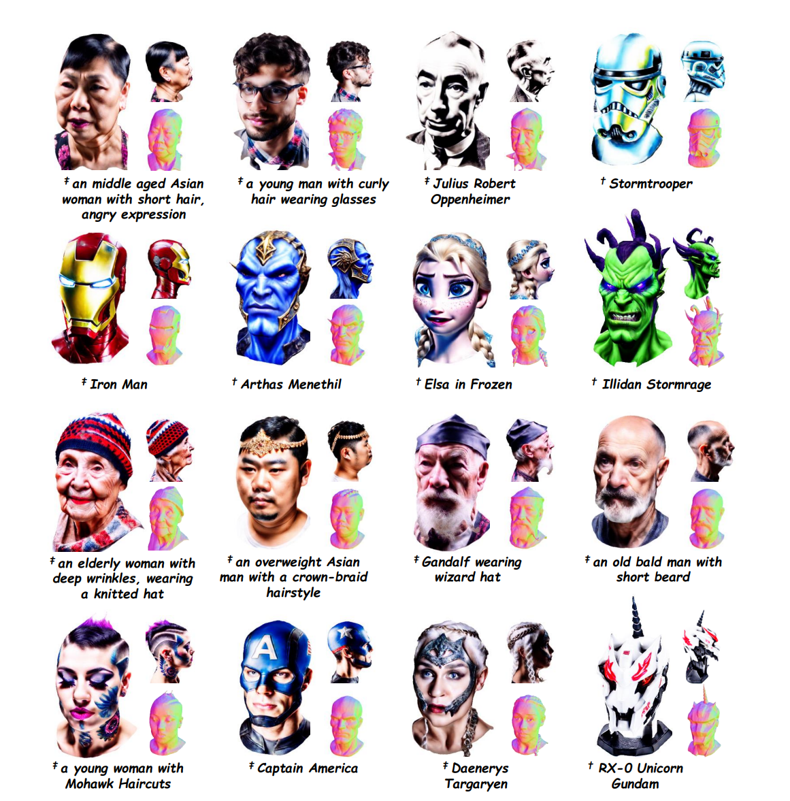
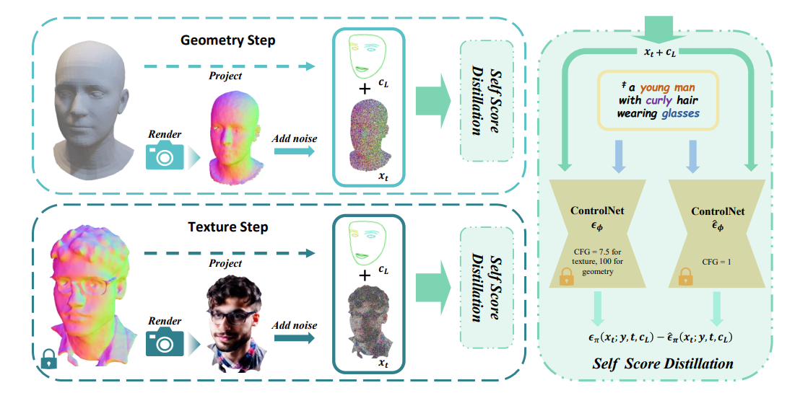

# HeadArtist
The official code of HeadArtist: Text-conditioned 3D Head Generation with Self Score Distillation

### [Project Page](https://kumapowerliu.github.io/HeadArtist/) | [Paper (ArXiv)](https://arxiv.org/abs/2312.07539)

[Hongyu Liu](https://kumapowerliu.github.io/)1,2,
[Xuan Wang](https://xuanwangvc.github.io/)2,
[Ziyu Wan](http://raywzy.com/)3,
[Yujun Shen](https://shenyujun.github.io/)2,
[Yibing Song](https://ybsong00.github.io/)4,
[Jing Liao](https://www.cityu.edu.hk/stfprofile/jingliao.htm)3,
[Qifeng Chen](https://cqf.io/)1 
1HKUST, 2Ant Group, 3City University of HongKong 4 AI3 Institute, Fudan University

## :star2: Pipeline
