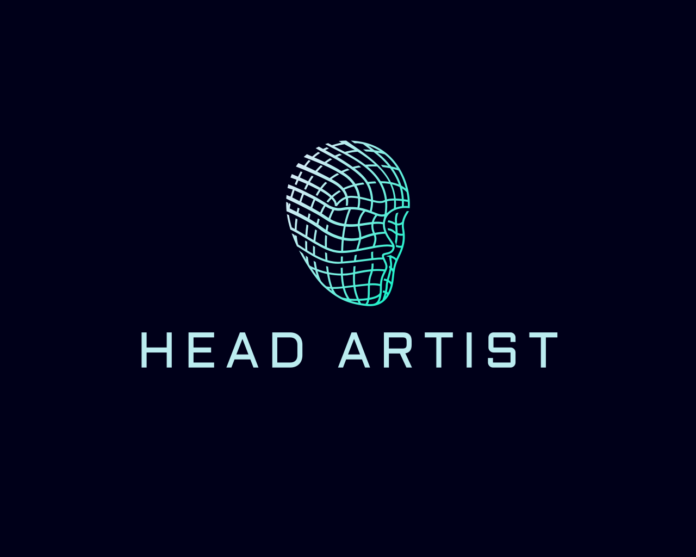

<p align="center">
    <picture>
    
    </picture>
</p>

# HeadArtist: Text-conditioned 3D Head Generation with Self Score Distillation, SIGGRAPH 2024 (Official Implementation)
### [Project Page](https://kumapowerliu.github.io/HeadArtist/) | [Paper (ArXiv)](https://arxiv.org/abs/2312.07539)


[Hongyu Liu](https://kumapowerliu.github.io/)<sup>1,2</sup>,
[Xuan Wang](https://xuanwangvc.github.io/)<sup>2</sup>,
[Ziyu Wan](http://raywzy.com/)<sup>3</sup>,
[Yujun Shen](https://shenyujun.github.io/)<sup>2</sup>,
[Yibing Song](https://ybsong00.github.io/)<sup>4</sup>,
[Jing Liao](https://www.cityu.edu.hk/stfprofile/jingliao.htm)<sup>3</sup>,
[Qifeng Chen](https://cqf.io/)<sup>1</sup><br>
<sup>1</sup>HKUST, <sup>2</sup>Ant Group, <sup>3</sup>City University of HongKong <sup>4</sup> AI<sup>3</sup> Institute, Fudan University
<p align="center">

</p>


<p align="center"><b>
👆 Results obtained from HeadArtist👆 <br/>
</b></p>

## Installation

See [installation.md](docs/installation.md) for additional information, including installation via Docker.

The following steps have been tested on Ubuntu20.04.

- You must have an NVIDIA graphics card with at least 6GB VRAM and have [CUDA](https://developer.nvidia.com/cuda-downloads) installed.
- Install `Python >= 3.8`.
- (Optional, Recommended) Create a virtual environment:

```sh
python3 -m virtualenv venv
. venv/bin/activate

# Newer pip versions, e.g. pip-23.x, can be much faster than old versions, e.g. pip-20.x.
# For instance, it caches the wheels of git packages to avoid unnecessarily rebuilding them later.
python3 -m pip install --upgrade pip
```

- Install `PyTorch >= 1.12`. We have tested on `torch1.12.1+cu113` and `torch2.0.0+cu118`, but other versions should also work fine.

```sh
# torch1.12.1+cu113
pip install torch==1.12.1+cu113 torchvision==0.13.1+cu113 --extra-index-url https://download.pytorch.org/whl/cu113
# or torch2.0.0+cu118
pip install torch torchvision --index-url https://download.pytorch.org/whl/cu118
```

- (Optional, Recommended) Install ninja to speed up the compilation of CUDA extensions:

```sh
pip install ninja
```

- Install dependencies:

```sh
pip install -r requirements.txt
```


## Training for HeadArtist
**If you are experiencing unstable connections with Hugging Face, we suggest you either (1) setting environment variable `TRANSFORMERS_OFFLINE=1 DIFFUSERS_OFFLINE=1 HF_HUB_OFFLINE=1` before your running command after all needed files have been fetched on the first run, to prevent from connecting to Hugging Face each time you run, or (2) downloading the guidance model you used to a local folder following [here](https://huggingface.co/docs/huggingface_hub/v0.14.1/guides/download#download-an-entire-repository) and [here](https://huggingface.co/docs/huggingface_hub/v0.14.1/guides/download#download-files-to-local-folder), and set `pretrained_model_name_or_path` and `controlnet_name_or_path` of the guidance and the prompt processor to the local path. (3) If you can not connect to the HuggingFace in China, you can use the [mirror HuggingFace](https://hf-mirror.com/) to download the models**

```sh
# Step 1. HeadArtist first generate the geometry, for the unreal-domain head (i.e., T800 in Terminator), you should set the prompt as "a head of T800 in Terminator" and do not use the "photorealistic, flawless face"    
python launch.py configs/headartist-geometry.yaml --train --gpu 0  system.prompt_processor.prompt="a DSLR portrait of elderly woman with deep wrinkles, wearing a knitted hat, photorealistic, flawless face"
# Step 2. To generate the texture, we set the default negative prompts in the config for the real-domain head. For the unreal-domain head, you may need to delete the sketch, cartoon, or drawing. You need set the geometry_convert_from as the output of step1.
python launch.py --config configs/headartist-texture.yaml --train --gpu 0 system.prompt_processor.prompt="a DSLR portrait of elderly woman with deep wrinkles, wearing a knitted hat, photorealistic, flawless face" system.geometry_convert_from=path/to/geometry/stage/trial/dir/ckpts/last.ckpt
# Step 3. We refine the texture further with the perceptual loss. We find the 700 steps can get the best generation quality, so we set the max_steps=20700. You need set the config and resume as the output of step2.
python launch.py --config path/to/trial/dir/configs/parsed.yaml --train --gpu 0 resume=path/to/trial/dir/ckpts/last.ckpt trainer.max_steps=20700 system.guidance.use_perceptual=True system.loss.lambda_ssd=0  system.loss.lambda_perceptual=100
```

threestudio uses [OmegaConf](https://github.com/omry/omegaconf) for flexible configurations. You can easily change any configuration in the YAML file by specifying arguments without `--`, for example the specified prompt in the above cases. For all supported configurations, please see our [documentation](https://github.com/threestudio-project/threestudio/blob/main/DOCUMENTATION.md).

The training lasts for 10,000 iterations. You can find visualizations of the current status in the trial directory which defaults to `[exp_root_dir]/[name]/[tag]@[timestamp]`, where `exp_root_dir` (`outputs/` by default), `name` and `tag` can be set in the configuration file. A 360-degree video will be generated after the training is completed. In training, press `ctrl+c` one time will stop training and head directly to the test stage which generates the video. Press `ctrl+c` the second time to fully quit the program.


### Resume from checkpoints

If you want to resume from a checkpoint, do:

```sh
# resume training from the last checkpoint, you may replace last.ckpt with any other checkpoints
python launch.py --config path/to/trial/dir/configs/parsed.yaml --train --gpu 0 resume=path/to/trial/dir/ckpts/last.ckpt
# if the training has completed, you can still continue training for a longer time by setting trainer.max_steps
python launch.py --config path/to/trial/dir/configs/parsed.yaml --train --gpu 0 resume=path/to/trial/dir/ckpts/last.ckpt trainer.max_steps=20000
# you can also perform testing using resumed checkpoints
python launch.py --config path/to/trial/dir/configs/parsed.yaml --test --gpu 0 resume=path/to/trial/dir/ckpts/last.ckpt
# note that the above commands use parsed configuration files from previous trials
# which will continue using the same trial directory
# if you want to save to a new trial directory, replace parsed.yaml with raw.yaml in the command

# only load weights from saved checkpoint but dont resume training (i.e. dont load optimizer state):
python launch.py --config path/to/trial/dir/configs/parsed.yaml --train --gpu 0 system.weights=path/to/trial/dir/ckpts/last.ckpt
```

### Export Meshes

To export the scene to texture meshes, use the `--export` option. We currently support exporting to obj+mtl, or obj with vertex colors.

```sh
# this uses default mesh-exporter configurations which exports obj+mtl
python launch.py --config path/to/trial/dir/configs/parsed.yaml --export --gpu 0 resume=path/to/trial/dir/ckpts/last.ckpt system.exporter_type=mesh-exporter
# specify system.exporter.fmt=obj to get obj with vertex colors
# you may also add system.exporter.save_uv=false to accelerate the process, suitable for a quick peek of the result
python launch.py --config path/to/trial/dir/configs/parsed.yaml --export --gpu 0 resume=path/to/trial/dir/ckpts/last.ckpt system.exporter_type=mesh-exporter system.exporter.fmt=obj
# for NeRF-based methods (DreamFusion, Magic3D coarse, Latent-NeRF, SJC)
# you may need to adjust the isosurface threshold (25 by default) to get satisfying outputs
# decrease the threshold if the extracted model is incomplete, increase if it is extruded
python launch.py --config path/to/trial/dir/configs/parsed.yaml --export --gpu 0 resume=path/to/trial/dir/ckpts/last.ckpt system.exporter_type=mesh-exporter system.geometry.isosurface_threshold=10.
# use marching cubes of higher resolutions to get more detailed models
python launch.py --config path/to/trial/dir/configs/parsed.yaml --export --gpu 0 resume=path/to/trial/dir/ckpts/last.ckpt system.exporter_type=mesh-exporter system.geometry.isosurface_method=mc-cpu system.geometry.isosurface_resolution=256
```

For all the options you can specify when exporting, see [the documentation](https://github.com/threestudio-project/threestudio/blob/main/DOCUMENTATION.md#exporters).

See [here](https://github.com/threestudio-project/threestudio#supported-models) for example running commands of all our supported models. Please refer to [here](https://github.com/threestudio-project/threestudio#tips-on-improving-quality) for tips on getting higher-quality results, and [here](https://github.com/threestudio-project/threestudio#vram-optimization) for reducing VRAM usage.


### Code Structure

Here we just briefly introduce the code structure of this project. We will make more detailed documentation about this in the future.

- All methods are implemented as a subclass of `BaseSystem` (in `systems/base.py`). There typically are six modules inside a system: geometry, material, background, renderer, guidance, and prompt_processor. All modules are subclass of `BaseModule` (in `utils/base.py`) except for guidance, and prompt_processor, which are subclass of `BaseObject` to prevent them from being treated as model parameters and better control their behavior in multi-GPU settings.
- All systems, modules, and data modules have their configurations in their own dataclasses.
- Base configurations for the whole project can be found in `utils/config.py`. In the `ExperimentConfig` dataclass, `data`, `system`, and module configurations under `system` are parsed to configurations of each class mentioned above. These configurations are strictly typed, which means you can only use defined properties in the dataclass and stick to the defined type of each property. This configuration paradigm (1) naturally supports default values for properties; (2) effectively prevents wrong assignments of these properties (say typos in the yaml file) or inappropriate usage at runtime.
- This projects use both static and runtime type checking. For more details, see `utils/typing.py`.
- To update anything of a module at each training step, simply make it inherit to `Updateable` (see `utils/base.py`). At the beginning of each iteration, an `Updateable` will update itself, and update all its attributes that are also `Updateable`. Note that subclasses of `BaseSystem`, `BaseModule` and `BaseObject` are by default inherited to `Updateable`.


## Credits

Our code is heavily built on the very amazing open-source project ***threestudio***:  


- **[threestudio](https://github.com/threestudio-project/threestudio)** :a unified framework for 3D content creation from text prompts, single images, and few-shot images, by lifting 2D text-to-image generation models.
 


## Citing HeadArtist

If you find HeadArtist helpful, please consider citing:

```
@inproceedings{10.1145/3641519.3657512,
author = {Liu, Hongyu and Wang, Xuan and Wan, Ziyu and Shen, Yujun and Song, Yibing and Liao, Jing and Chen, Qifeng},
title = {HeadArtist: Text-conditioned 3D Head Generation with Self Score Distillation},
year = {2024},
isbn = {9798400705250},
publisher = {Association for Computing Machinery},
address = {New York, NY, USA},
url = {https://doi.org/10.1145/3641519.3657512},
doi = {10.1145/3641519.3657512},
abstract = {We present HeadArtist for 3D head generation following human-language descriptions. With a landmark-guided ControlNet serving as a generative prior, we come up with an efficient pipeline that optimizes a parameterized 3D head model under the supervision of the prior distillation itself. We call such a process self score distillation (SSD). In detail, given a sampled camera pose, we first render an image and its corresponding landmarks from the head model, and add some particular level of noise onto the image. The noisy image, landmarks, and text condition are then fed into a frozen ControlNet twice for noise prediction. We conduct two predictions via the same ControlNet structure but with different classifier-free guidance (CFG) weights. The difference between these two predicted results directs how the rendered image can better match the text of interest. Experimental results show that our approach produces high-quality 3D head sculptures with rich geometry and photo-realistic appearance, which significantly outperforms state-of-the-art methods. We also show that our pipeline supports editing operations on the generated heads, including both geometry deformation and appearance change. Project page:https://kumapowerliu.github.io/HeadArtist.},
booktitle = {ACM SIGGRAPH 2024 Conference Papers},
articleno = {16},
numpages = {12},
keywords = {3D Head Generation, 3D Head editing, Self Score Distillation, Text Guided},
location = {Denver, CO, USA},
series = {SIGGRAPH '24}
}
```

 